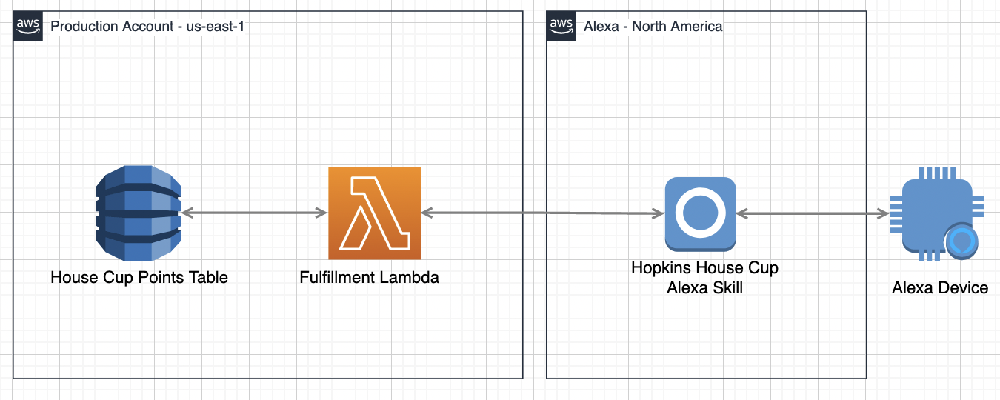
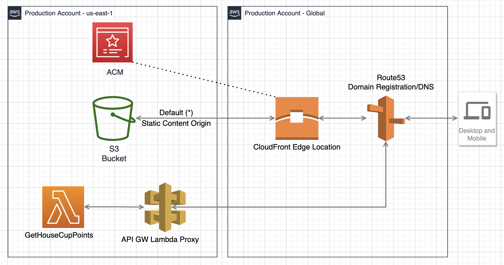

# Hopkins House Cup - AWS CDK

This repo allows for repeatedly deploying the *Hopkins House Cup Website* and *Hopkins House Cup Alexa Skill* with very little manual prerequisites. The site leverages S3 and CloudFront's global distributed network of edge locations for website hosting as well as Alexa, Lambda and DynamoDB for vocal recognition of point addition/subtraction logic. 

## Architecture Diagrams



## TODO
- Split out hopkins_house_cup_stack.py into more readable functions/constructs
- Add unit tests
- Setup CDK Pipelines for CI/CD on repo update

## Getting started
As previously mentioned the amount of pre-requisites to get up and running are very minimal thanks to the CDK handling the large majority of heavy lifting for deployment.

### Manual pre-reqs
- Register any domain name in Route53
- Setup and configure Amazon developer account

#### 1. Create an [Amazon Developer account](https://developer.amazon.com/)
Alexa is an Amazon product even though it can be deployed through AWS you still need to have a separate [Amazon Developer account](https://developer.amazon.com/)

#### 2. Create a [Developer Account Security Profile](https://developer.amazon.com/loginwithamazon/console/site/lwa/create-security-profile.html).

  Open the [Developer Account Security Profile](https://developer.amazon.com/loginwithamazon/console/site/lwa/create-security-profile.html) page and feel free to use whatever values you want for the Security Profile Name and Description. The Privacy Notice URL must be a valid URL format but does not need to be a valid URL. Once you create your security profile, navigate to the `Web Settings` tab and add the following as `Allowed Return URLs`:
   - `http://127.0.0.1:9090/cb`
   - `https://s3.amazonaws.com/ask-cli/response_parser.html`
   
   
#### 3. Copy Your `Client Id` and `Client Secret` from the security profile
Keep these values safe as we will use them in a second.

#### 4. Make Sure You Have An AWS Account with CLI Access
You will need this to deploy the CDK stack anyway but for the next step we need to associate Alexa with our AWS Account so this is crucial.

#### 5. Setup ASK CLI on your local machine
Alexa needs to associate your Amazon Developer Account with your AWS Account. The easiest way to do this is to run `ask configure` after you have installed the [Alexa Skills Kit CLI](https://developer.amazon.com/en-US/docs/alexa/smapi/quick-start-alexa-skills-kit-command-line-interface.html)

#### 6. Generate a Refresh Token
We are going to use Postman to fetch a new `OAuth 2.0` token

Set the following key/values in the request:

| Field            | Value                                                                                                                                 |
|------------------|---------------------------------------------------------------------------------------------------------------------------------------|
| Grant Type       | Authorization Code                                                                                                                    |
| Callback URL     | http://127.0.0.1:9090/cb                                                                                                              |
| Auth URL         | https://www.amazon.com/ap/oa                                                                                                          |
| Access Token URL | https://api.amazon.com/auth/o2/token                                                                                                  |
| Client ID        | {YOUR_CLIENT_ID}                                                                                                                      |
| Client Secret    | {YOUR_CLIENT_SECRET}                                                                                                                  |
| Scope            | alexa::ask:skills:readwrite alexa::ask:models:readwrite alexa::ask:skills:test alexa::ask:catalogs:read alexa::ask:catalogs:readwrite |
|                  |                                                                                                                                       |

A Pop-Up should show up prompting you to log into your Developer account. Log in and you will be redirected to Postman where you should have a `refresh_token` to use in the next steps

#### 7. Copy Your Vendor ID
Visit the [Customer Details Page](https://developer.amazon.com/settings/console/mycid) for your Amazon Developer Account and make a note of your "vendor ID"


### Before You Deploy
You need to add your ClientID, ClientSecret, Refresh Token and VendorID to the skill resource which can be found in `hopkins_house_cup_stack.py`
```
      vendorId: 'foo',
      authenticationConfiguration: {
        clientId: 'foo',
        clientSecret: 'bar',
        refreshToken: 'foobar'
      },
```

### How Do I Test This After Deployment?

1. Navigate to the Alexa Developer Console, or follow this link - https://developer.amazon.com/alexa/console/ask
2. If you see a skill named "CDK Patterns Sample" in your Alexa Skills list then it has successfully been uploaded! Now we just need to test the skill itself.
3. Select the Hopkins House Cup skill by clicking on the name.
4. On the next page, select "Test" at the top of the screen. 
5. Amazon will ask if you'd to use your microphone or not. This is entirely optional as you may test Alexa using either voice commands or  the text box provided.
6. Change the "skill testing is enabled in:" option from "Off" to "Development" if needed.
7. Either type or say "hopkins house cup" (Case sensitive if typing) and wait for a response.
8. The response should be as in your intent code
9. Now we just need to confirm that it is interacting with DynamoDB correctly.
10. Go to the AWS Console and navigate to DynamoDB. Open your tables and find the one corresponding to the Hopkins House Cup stack.
11. Confirm that one item is in the table. 

### CDK Setup
Install or update the [AWS CDK CLI](https://github.com/aws/aws-cdk) from npm (requires [Node.js ≥ 14.15.0](https://nodejs.org/download/release/latest-v14.x/)). 


```bash
npm i -g aws-cdk
```

Clone this repo locally.

```bash
$ git clone https://github.com/moebaca/hopkins-house-cup.git
$ cd hopkins-house-cup
```

Now install our NPM dependencies

```bash
$ npm install
```

### Bootstrap CDK environment

Before you deploy the application you need to make sure the environment
where you are planning to deploy the site to has been bootstrapped,
specifically with the newest version of the bootstrapping stack. 

You will need to bootstrap every environment you plan to deploy the CDK
application to, which in this example is a single account. 

You only need to do this one time per environment where you want to deploy
CDK applications. If you are unsure whether your environment has been
bootstrapped already, you can always run the command again. 

Make sure you have credentials for the account and run the following
command. Since we are only bootstrapping a single environment, we don't
need to specify the environment in the bootstrap command. The CLI will
know whih environment to bootstrap based on your .aws/credentials file
(assuming a Unix-like environment as I have not tested this on Windows).

```bash
$ cdk bootstrap --cloudformation-execution-policies arn:aws:iam::aws:policy/AdministratorAccess
```

### Deploy

You should now have met all the conditions to safely deploy the project to your AWS account. Run the below command with the required parameters.
- account_id = The account id needs to be explicitly passed as a parameter as a requirement for hosted-zone lookups
- domain = Route53 registered domain name that resides in the same account as passed above

Example:
```bash
$ cdk deploy -c domain=hopkinshousecup.com -c account_id=1234567890
```

### Tear down

Tear down is mostly as simple as running the below command:

```bash
$ cdk destroy -c domain=hopkinshousecup.com -c account_id=1234567890
```
